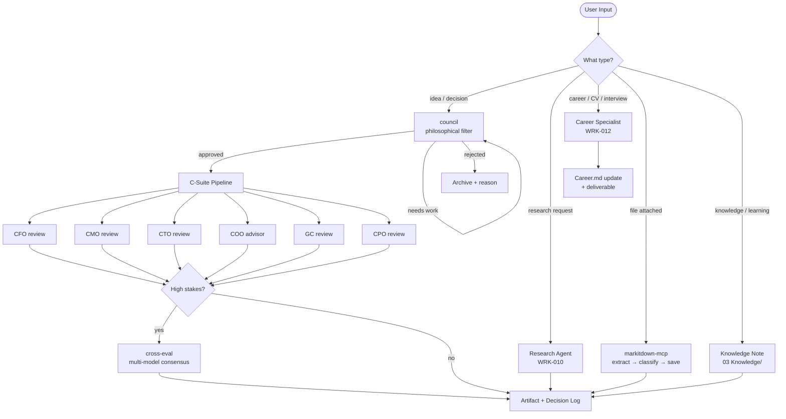
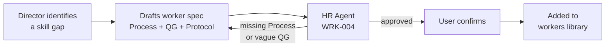

# ai-external-brain

> In an era where information moves faster than any individual can process it, the competitive edge belongs to those who connect the right dots at the right time.

---

## Why this exists

**Your past self briefs your future self.**
Every session auto-reads your dashboard, inbox, and active projects. Zero re-explaining. Zero lost context.

**A boardroom on demand — in seconds.**
Need a CFO's take on a business model? A lawyer's read on a contract? A CTO's review of your architecture? Deployed in parallel, not days later.

**Expertise that never fabricates.**
Financial rates, library versions, market data — always fetched live via tools. No confident lies dressed as facts.

**Every decision leaves a trace.**
Career moves, financial choices, project pivots — logged, dated, searchable. Your knowledge compounds with every session.

**The system hires its own team.**
New workers are screened by an internal HR agent before entering the library — rejected if methodology is vague, quality gates are missing, or the role is redundant.

---

## How it works

---

## Hiring a new worker

---

## The team

| ID | Worker | Domain | Always in team |
|----|--------|--------|:--------------:|
| WRK-001 | QA Reviewer | Quality control | Yes |
| WRK-002 | Project Manager | Scope, timeline, client expectations | Yes |
| WRK-003 | Client Presenter | Output adapted to audience level | Yes |
| WRK-004 | HR Agent | Screens new workers before library entry | — |
| WRK-005 | Financial Modeler | DCF, scenario analysis, Excel models | — |
| WRK-006 | Data Analyst | Insights, visualization, patterns | — |
| WRK-009 | Broker | Investment instruments, deal structuring | — |
| WRK-010 | Research Agent | Due diligence, source synthesis, fact-checking | — |
| WRK-011 | Strategy Consultant | OKR, scenario planning, competitive strategy | — |
| WRK-012 | Career Specialist | CV/CL DE+EN, ATS, interview prep, DACH market | — |
| WRK-013 | Software Engineer | Architecture, backend, system design | — |
| WRK-014 | Debugger | Root cause analysis, error tracing | — |
| WRK-015 | Tester | Test strategy, edge cases | — |
| WRK-016 | Marketer | Positioning, growth, content channels | — |
| WRK-017 | Web Developer | Frontend, React/Next.js, deployment | — |
| WRK-018 | Treasury Expert | Cash management, FX, working capital | — |
| WRK-019 | Cybersecurity Expert | Pentest, AI security, prompt injection | — |
| WRK-007 | Copywriter (Deutsch) | Professional German text, DACH market | — |
| WRK-008 | Beverage Expert | Bar menus, F&B concepts | — |

---

## Stack

| Layer | Tool |
|-------|------|
| Knowledge base | Obsidian |
| AI backbone | Claude Code |
| Document processing | markitdown-mcp |
| Library documentation | context7 MCP |
| Email | Gmail MCP |
| Files | Google Drive MCP |
| Calendar | Google Calendar MCP |
| Version control | GitHub MCP |
| Skills runtime | Superpowers (Anthropic official) + 242 installed skills |

---

## Setup

1. Clone into your Obsidian vault folder
2. Install [Claude Code](https://claude.ai/code)
3. `claude plugin install superpowers@claude-plugins-official`
4. Configure MCP servers per `CLAUDE.md`
5. Open a session from the vault root — Claude reads context automatically

---

*Built with [Claude Code](https://claude.ai/code)*
