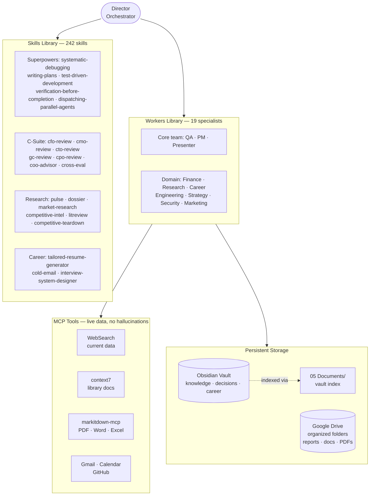
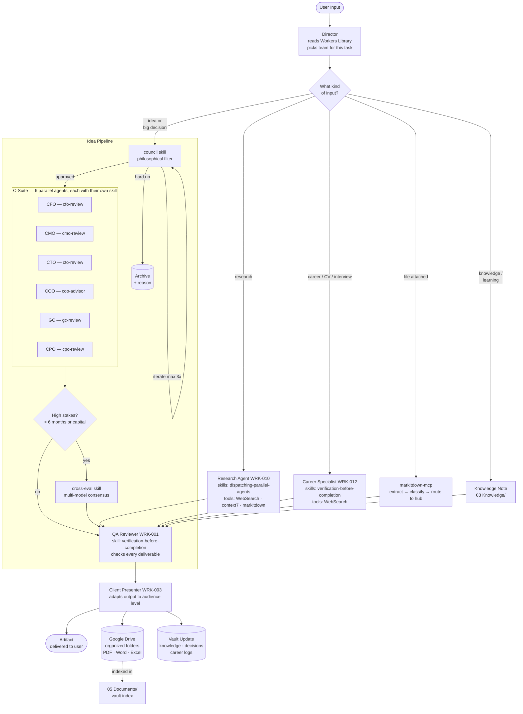
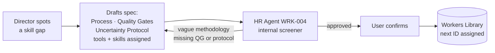

# ai-external-brain

> In an era where information moves faster than any individual can process it, the competitive edge belongs to those who connect the right dots at the right time.

---

## Why this exists

**Your past self briefs your future self.**
Every session auto-reads your dashboard, inbox, and active projects. Zero re-explaining. Zero lost context.

**A boardroom on demand — in seconds.**
Need a CFO's take on a business model? A lawyer's read on a contract? A CTO's review of your architecture? Deployed in parallel, not days later.

**Expertise that never fabricates.**
Financial rates, library versions, market data — always fetched live via tools. No confident lies dressed as facts.

**Every decision leaves a trace.**
Career moves, financial choices, project pivots — logged, dated, searchable. Your knowledge compounds with every session.

**The system hires its own team.**
New workers are screened by an internal HR agent before entering the library — rejected if methodology is vague, quality gates are missing, or the role is redundant.

---

## System Architecture

Three libraries power everything. The Director orchestrates — workers pull their skills and tools on demand.

---

## Request Flow

Every worker carries their own assigned skill set. Skills define HOW they work — tools define WHERE they get data.

---

## Hiring a new worker

---

## The team

Each worker ships with a defined methodology, quality gates they cannot bypass, and a personal skill + tool set.

| ID | Worker | Skills | Tools |
|----|--------|--------|-------|
| WRK-001 | QA Reviewer | verification-before-completion | markitdown-mcp |
| WRK-002 | Project Manager | verification-before-completion | Gmail · Calendar |
| WRK-003 | Client Presenter | verification-before-completion | Drive · markitdown |
| WRK-004 | HR Agent | verification-before-completion | WebSearch |
| WRK-005 | Financial Modeler | verification-before-completion | markitdown · context7 |
| WRK-006 | Data Analyst | verification-before-completion | WebSearch · context7 · markitdown |
| WRK-007 | Copywriter (Deutsch) | verification-before-completion | context7 |
| WRK-008 | Beverage Expert | verification-before-completion | WebSearch |
| WRK-009 | Broker | verification-before-completion | WebSearch · context7 |
| WRK-010 | Research Agent | dispatching-parallel-agents · verification | WebSearch · context7 · markitdown |
| WRK-011 | Strategy Consultant | brainstorming · verification | WebSearch · context7 |
| WRK-012 | Career Specialist | verification-before-completion | WebSearch |
| WRK-013 | Software Engineer | writing-plans · systematic-debugging · TDD · code-review | context7 · WebSearch |
| WRK-014 | Debugger | systematic-debugging · verification | context7 · WebSearch |
| WRK-015 | Tester | test-driven-development · verification | context7 · WebSearch |
| WRK-016 | Marketer | brainstorming · verification | WebSearch · context7 |
| WRK-017 | Web Developer | writing-plans · TDD · code-review | context7 · WebSearch |
| WRK-018 | Treasury Expert | verification-before-completion | WebSearch · context7 |
| WRK-019 | Cybersecurity Expert | systematic-debugging · verification | WebSearch · context7 |

---

## Stack

| Layer | Tool |
|-------|------|
| Knowledge base | Obsidian |
| AI backbone | Claude Code |
| Document processing | markitdown-mcp |
| Library documentation | context7 MCP |
| Email | Gmail MCP |
| Files | Google Drive MCP |
| Calendar | Google Calendar MCP |
| Version control | GitHub MCP |
| Skills runtime | Superpowers (Anthropic official) + 242 installed skills |

---

## Setup

1. Clone into your Obsidian vault folder
2. Install [Claude Code](https://claude.ai/code)
3. `claude plugin install superpowers@claude-plugins-official`
4. Configure MCP servers per `CLAUDE.md`
5. Open a session from the vault root — Claude reads context automatically

---

*Built with [Claude Code](https://claude.ai/code)*
